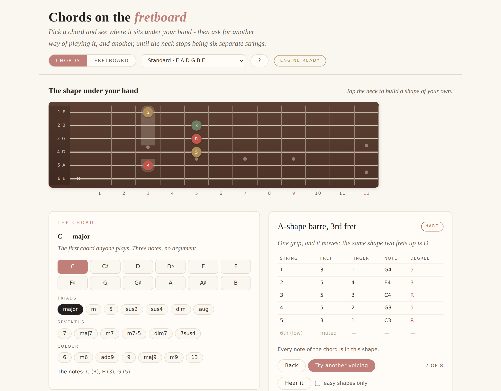
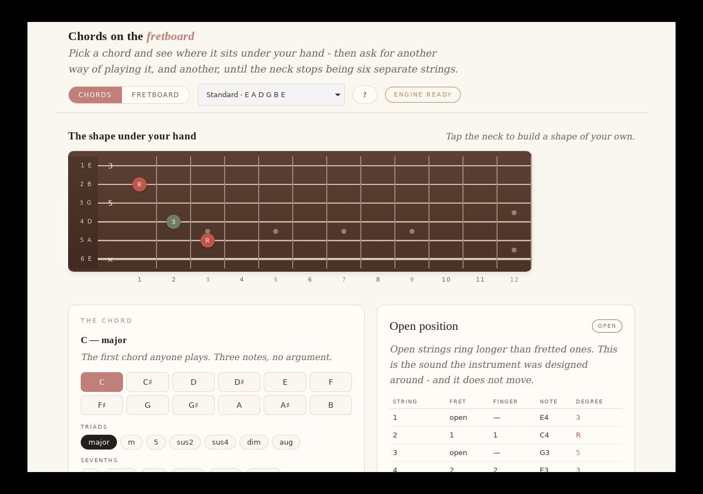
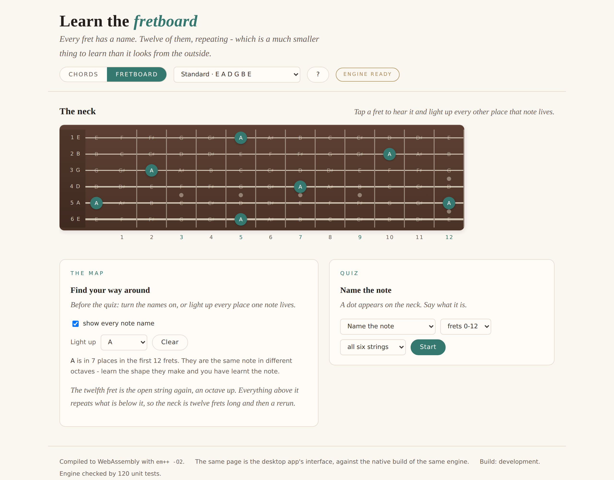

# Guitar Learning App

A cross-platform guitar education app built on JUCE. Two things over one neck:
find every way of playing a chord, and learn what the notes on the fretboard
actually are.

There is no piano in it anywhere. The fretboard is the instrument, the diagram
and the input device, and everything the engine knows is expressed in strings
and frets rather than in MIDI notes that happen to be playable on a guitar.



## Layout

| Directory | Layer | Depends on |
|---|---|---|
| `modules/core_engine` | The fretboard, chord parsing, shape generation, shape reading, the quiz. Pure C++17. | nothing |
| `modules/engine_api` | The engine's answers as JSON - one wire format, read by both shells. Pure C++17. | core engine |
| `web` | **The user interface.** One page, served on the web and hosted by the app, plus the WebAssembly build, the offline worker and the smoke test that drives the built page. | engine API (as JSON) |
| `app` | Platform shell: a window with a webview showing `web/`. | engine API, JUCE |
| `tests` | Engine unit tests (120), no JUCE, no third-party framework. | core engine, engine API |

The core engine links no JUCE at all - that boundary is what keeps a future
plugin or mobile target possible without a rewrite, and the build enforces it.

**There is one user interface, and it is the web page.** The desktop app shows
that same page in a webview and keeps for itself only what a page cannot do:
owning a window and a process. The engine it talks to is the native C++ already
in that process - the app needs no Emscripten to build, and the WebAssembly
build exists only for the browser.

The shell is unusually small for a JUCE app, and that is on purpose. There is no
audio device in it: the plucked string you hear is WebAudio, which a webview has
exactly as a browser does, so it is written once and works in both.

## Building

Requires CMake 3.22+ and a C++17 compiler. JUCE is resolved by
`cmake/GetJUCE.cmake`, in this order: `-DJUCE_PATH=/path/to/JUCE`, a `JUCE/`
checkout beside this repo, or `FetchContent` from GitHub (JUCE 8.0.4).

```bash
# Everything: engine, UI, standalone app, tests
cmake -S . -B build -DJUCE_PATH=/path/to/JUCE
cmake --build build

# Engine + tests only - no JUCE, no GUI libraries needed
cmake -S . -B build-core -DGUITAR_BUILD_APP=OFF
cmake --build build-core
./build-core/tests/guitar_core_tests     # or: ctest --test-dir build-core
```

Both configurations run in CI on every push (`.github/workflows/ci.yml`): the
engine job deliberately runs on a machine with no JUCE and no GUI packages, so if
it fails the module boundary has been crossed rather than the runner being short
a dependency.

On Linux the app needs WebKitGTK for its webview (`libgtk-3-dev`,
`libwebkit2gtk-4.1-dev`; 4.0 also works) plus the usual JUCE packages
(`libasound2-dev`, `libx11-dev`, `libxcomposite-dev`, `libxcursor-dev`,
`libxext-dev`, `libxinerama-dev`, `libxrandr-dev`, `libxrender-dev`,
`libfreetype6-dev`, `libfontconfig1-dev`, `libglu1-mesa-dev`,
`mesa-common-dev`). macOS and Windows need nothing extra - WKWebView is part of
the system and WebView2 comes in through JUCE.

**iOS**: configure with the JUCE iOS toolchain (`-DCMAKE_SYSTEM_NAME=iOS -GXcode`)
and open the generated project. **Android**: JUCE's CMake support does not cover
Android, so that target needs the Projucer/Gradle exporter over the same sources.

## Trying it

The app opens on the neck, with a C major under your hand. The desktop app and
the browser page are not merely alike: they are the same page, and which of the
two engines is behind it is written in the colophon at the foot.



**Chords** and **Fretboard**, at the top, are the two things you can practise.
They are modes over one neck, not two screens - the tuning, the diagram and the
engine stay exactly where they were.

### Chord practice

Pick a root and a quality and the first shape appears on the neck, with each
string labelled by the degree it is sounding rather than by its note name: root
in red, third in green, fifth in gold. Underneath, the same shape as a table -
string, fret, which finger, what note, which degree - and a line saying which
chord tones the shape leaves out, because on six strings with four fingers it
nearly always leaves out something.

**Try another voicing** is the heart of it. The list it walks is not a table of
diagrams somebody typed in: the engine enumerates every combination of frets in
each four-fret window of the neck whose notes are in the chord, throws away the
ones a hand cannot make or that are missing a note the chord cannot do without,
and then spreads what is left along the neck. So the second answer is somewhere
else on the neck, not the same grip with one string muted - and the eighth is
still a chord you would actually play.

For C you get the open chord, the A-shape barre at the third fret, the E-shape
barre at the eighth, a triad up at the tenth, and several voicings in between.
For `F#m7b5` in DADGAD you get whatever that tuning makes possible, worked out
from the same rules; nothing here was written down for any particular chord.

Every shape is named for what it is - *Open position*, *E-shape barre, 5th
fret*, *Shell voicing, 8th fret*, *Movable shape, 7th fret (over G)* - and the
name is read off the shape rather than looked up. A barre chord is drawn with a
bar under the fingers, because six dots at the same fret is a picture of six
fingers.

There is also a difficulty on each one: *open*, *easy*, *moderate*, *hard*,
worked out from the barre, the span and the number of fingers. **Easy shapes
only** filters the list to what a beginner can hold.

### Reading back what you play

Tap the neck and it becomes yours. The first tap takes the shape over from the
suggestion and starts from it, so changing one note and seeing what it becomes
takes one tap; tapping a fret again lets that string go.

Whatever you build, the engine names:

> **C** — C - major. It would also answer to Am7.

and **Check it against C** measures the same shape against the chord you asked
for, which is a different question and a more useful one while you are learning:

> **That's it, inverted** — All the right notes, with G at the bottom rather
> than C. A real voicing - just a different one.

> **Nearly** — Every note is in the chord, but 3 is missing - and that is the
> note that makes it major.

> **Not this one** — F4 is not in C. Check which string that is on.

Naming a set of notes is harder than it looks in the other direction, because a
set of notes will happily be named as some rootless extension of a chord nobody
was playing, and that name will be correct and useless. The scoring is biased
towards the small, ordinary chord: an open C is named C, not Am7 with no root.



### Fretboard practice

The neck with every note on it, and a way to stop it being 78 separate facts.

**Light up** a note and every place it lives appears, with the rest of the neck
going quiet behind it. That is the lesson: the seven C's in the first twelve
frets make a shape, and learning the shape is learning the note.

Then the quiz. Four kinds, and the engine sets them all:

| | Asks | Answered by |
|---|---|---|
| **Name the note** | a dot on the neck | one of four note names |
| **Find the note** | a note name and a string | tapping the neck |
| **Find the octave** | a marked place | tapping another place with the same name |
| **Which note of the chord** | a chord and a place | which degree of it you are on |

You can narrow it to a range of frets, or to one string - which is how the neck
is actually learnt, the sixth and fifth first, because that is where barre chord
roots live.

Two things make it a drill rather than a quiz. The first is that the questions
are not a uniform sample: a place that has already caught you out is three times
as likely to come back, so a run gets harder exactly where it should. The
second is that the answers say something:

> **Yes** — A2. The same note as the open 5th string.

> **Not quite** — It is D#3. One fret above the 3rd-fret dot.

Nobody navigates a neck by fret numbers, and a quiz that only confirms the
number is teaching the number. Tapping the right note in a place that was not
asked for is told apart from a wrong answer too, because it means something
different: *Right note, and not one of the places asked for - that is the octave
shape half-learnt.*

**Finish** sums the run up in words as well as numbers:

> 14 out of 18.
> - The 5th string (A) is where this falls down - 2 of 5. Worth a run on that string alone.
> - The natural notes are solid and the sharps are not, which is the usual order of things.
> - Below the fifth fret is known ground; above it is not. The twelfth fret is the same as the open string - working down from there is quicker than counting up.

Each observation has a floor under it - a string asked about twice says nothing
about that string - so it stays quiet rather than inventing a pattern out of
four questions.

### Tunings

Five, from the menu at the top: standard, drop D, half a step down, open G and
DADGAD. Changing one redraws the neck, renames every fret and works the chord
shapes out again from scratch. Nothing in the engine assumes standard tuning -
open G really does give you a G chord with nothing fretted, and drop D really
does put a power chord under one finger, because both fall out of the same
search rather than being special cases.

## Trying the engine in a browser

`web/index.html` is the whole interface, and it runs against the engine compiled
to WebAssembly:

```bash
./web/build.sh out                    # needs Emscripten
cp web/index.html web/sw.js out
node web/smoke-test.mjs out           # drives the built page in a real browser
python3 -m http.server --directory out
```

The smoke test is worth running after any change to the page. It boots the built
page, checks the neck is drawn, walks the voicings, taps a shape in and reads it
back, runs a quiz both ways, changes tuning, checks nothing runs off the side of
a 430px phone, and asserts that the offline worker actually stocked the cache.
CI runs it before every deploy, because a build that compiles has never been the
thing that goes wrong.

Once visited, the page works offline: `web/sw.js` keeps the page and the engine,
network-first so a deploy is live the moment it lands.

## What the engine does today

**The fretboard** (`Fretboard`, `Tuning`) - any tuning, any number of strings,
notes at positions, every place a note lives, octave twins. One coordinate
system, documented in `docs/FRETBOARD.md`.

**Chords** (`ChordSymbol`) - 21 qualities from major to dominant thirteenth,
read from the spellings people actually write (`Am`, `Amin`, `A-`, `AMI`),
alterations (`7b9`, `7#5`, `m7b5`), slash chords. Each quality knows which of
its notes it cannot do without, which is what makes a voicing missing a fifth a
voicing and a voicing missing a third a different chord.

**Shapes** (`ChordShapes`) - the generator described above, with a fingering
worked out for every shape it offers. `docs/CHORD_SHAPES.md` covers the search,
what gets thrown away and why the ranking is what it is.

**Reading a shape** (`ShapeIdentifier`) - naming what is fretted, and measuring
it against a chord that was asked for.

**The quiz** (`FretboardQuiz`) - four drills, weighted question selection, and a
summary in words. `docs/QUIZZES.md` covers why it lives in the engine and why
the engine still has no clock.

All of it is covered by 120 unit tests with no third-party test framework, none
of which need a GUI, a browser or a guitar.

## Not built yet

Deliberately open, rather than forgotten:

- **Scales and arpeggios on the neck.** The obvious next thing, and the one
  place where it is not yet clear whether it is a third mode or an extension of
  chord practice.
- **Anything remembered between sessions.** The quiz summary is per-run; the
  engine stores nothing. The weighting would be much better if it did.
- **A progression to play along with**, a metronome, strumming patterns.
- **Seven-string, bass and left-handed.** All cheap in the engine - a tuning is
  a list of any length - and all changes to how the page draws.
- **Audio input.** Listening to the guitar and telling you whether you played
  the shape is a different and much larger project (pitch detection over six
  simultaneous strings), and is out of scope on purpose.
